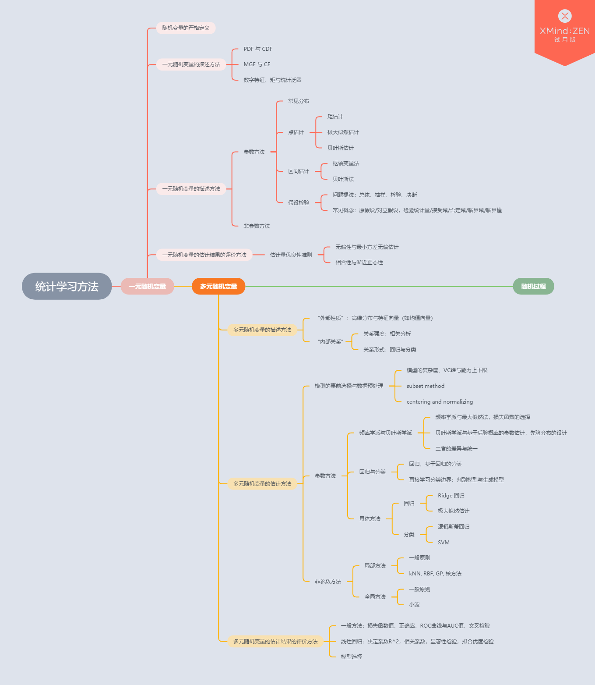

<!--##### Table of Contents  
[Headers](#headers)  
[Emphasis](#emphasis) -->

<!--[//]: # (https://stackoverflow.com/questions/18244417/how-do-i-create-some-kind-of-table-of-content-in-github-wiki)->
<!---
your comment goes here
and here
-->
# 0. 序言
统计学的核心主题有三：
- 研究对象建模
- 对研究对象的描述方法/工具
- 对描述工具的估计

基本矛盾有四：
- 离散与连续
- 静态与动态
- 频率方法和贝叶斯方法
- 参数方法和非参数方法

## 0.1 研究对象：一元、多元、随机过程
研究对象不同，我们对研究对象的建模方式也有所区别. 从数量上来分类，最简单的情况是对单个随机变量的研究；若同时对多个随机变量进行研究，则问题则（大多数时候）转变为对随机向量的研究；若将随机变量数量扩展至无穷多，则问题变为对随机过程的研究.

## 0.2 对研究对象的描述
**完全描述与部分描述.** 研究对象不同，对其的描述方法也就不同. 不过一般而言我们对各种随机变量的描述可以分为完全描述和部分描述两类. 完全描述——如PDF——正如其名，完全描述了一个随机变量. 部分描述则描述了随机变量某一侧面的性质. ...

**对不同种类研究对象的描述.** 对单个随机变量，我们可以研究其分布(具体来说可以是CDF/PDF/MGF/CF)和数字特征(期望、方差等). 对于随机向量，一方面我们可以将其视作一个整体去研究它的“外部性质”，这时我们的描述方法与单变量时无异(事实上我们完全可以将其看作高维空间中的单一变量)，亦即其(多元)分布与数字特征(向量)；另一方面，我们也可以研究其中各部分间的“内部关系”，如用相关系数表示关系强弱，或进行回归分析以找出关系的具体形式. 值得指出的是，多元变量的“内部”和“外部”性质是紧密相关的. 例如若随机向量 X 服从多元高斯分布，则其在高位空间中分布的离散情况正是由其对协方差矩阵  ——也即两两维度间的协方差所决定的.

**随机变量的动态性质.** 若我们的目标是研究某个随机变量 X，而我们恰好知道 X 与另一随机变量 Z 之间存在某种关系 ，且 f 的形式和 Z 的性质已知，则我们可以通过研究 f(Z) 的性质从而间接得知 X 的性质. 例如我们希望研究 P(Y)，且已知另一变量 X 服从(多元)高斯分布并与 Y 存在线性关系 ，那么我们可以通过研究线性变换对高斯分布的影响从而研究 Y 的性质.

## 0.3 对描述工具的估计
**参数估计与非参数估计.** （例子：双峰）

**频率方法与贝叶斯方法**

**回归与分类**（是否估计分布）

## 0.4 对估计结果的评价

# 1. 一元随机变量
## 1.0 随机变量的定义
- )
## 1.1 一元随机变量的描述方法
- PDF 与 CDF
- MGF 与 CF
- 数字特征、矩与统计泛函
## 1.2 一元随机变量的估计方法
### 1.2.1 参数方法
### 1.2.1.1 常见分布
- 高斯分布, etc.

### 1.2.1.2 点估计
- 矩估计
- 极大似然估计
- 贝叶斯估计
### 1.2.1.3 区间估计
- 枢轴变量法
- 贝叶斯法
### 1.2.1.4 假设检验：“广义”估计
- 问题提法：总体、抽样、检验、决断
- 常见概念：原假设/对立假设，检验统计量/接受域/否定域/临界域/临界值

### 1.2.2 非参数方法
- 蒙特卡洛(MC)
- 核方法

## 1.3 一元随机变量的估计结果的评价方法
### 1.3.1 估计量优良性准则
- 无偏性与最小方差无偏估计
- 相合性与渐近正态性

# 2. 多元随机变量
## 2.1 多元随机变量的描述方法
### 2.1.1 “外部性质”：高维分布与特征向量（如均值向量）
- 多元高斯分布的形式与性质

### 2.2.2 “内部关系”
- 关系强度：相关分析
- 关系形式：回归与分类

## 2.2 多元随机变量的估计方法
### 2.2.0 模型的事前选择与数据预处理
- 模型的复杂度、VC维与能力上下限
- subset method
- centering and normalizing

### 2.2.1 参数方法
#### 2.2.1.1 频率学派与贝叶斯学派
- 频率学派与最大似然法，损失函数的选择
- 贝叶斯学派与基于后验概率的参数估计，先验分布的设计
- 二者的差异与统一

#### 2.2.1.2 回归与分类
- 回归，基于回归的分类
- 直接学习分类边界：判别模型与生成模型

### 2.2.2 非参数方法
#### 2.2.2.1 局部方法
- 一般原则
- kNN, RBF, GP

#### 2.2.2.2 全局方法
- 一般原则
- 小波

## 2.3 多元随机变量的估计结果的评价方法
- 一般方法：损失函数值，正确率，ROC曲线与AUC值，交叉检验
- 线性回归：决定系数R^2，相关系数，显著性检验，拟合优度检验
- 模型选择

# 3. 待整理
- 方差分析

<!--})-->
